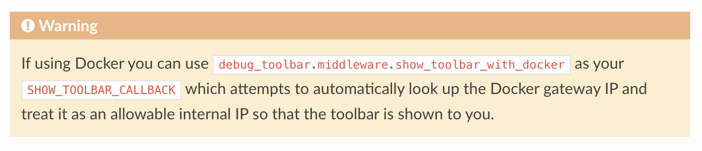

# 前提
- ローカル環境で作業するとき、コマンドはすべて「GitBash」または「bash」で実施すること
- PowerShellは、特別に指示がない限り使わないこと
- リポジトリの中に、リポジトリを作らないこと
  - ※例えば、リポジトリ「ohara_uml」の中にリポジトリ「django_sample」をクローンしない
- VSCodeウィンドウはリポジトリの数だけ開いておき、Alt + Tab で切り替えること

# Docker Desktopのインストール
- [こちら](https://zenn.dev/upgradetech/articles/8e8b82e9d5c494)を参考に導入

# WSLのインストール
- ディストリビューションはUbuntu
- [こちら](https://zenn.dev/kuuki/articles/windows-ubuntu-insall)を参考に導入

# Dockerコンテナに入るまで
- VSCodeの拡張機能として[Dev Containers](https://marketplace.visualstudio.com/items?itemName=ms-vscode-remote.remote-containers)をインストール
- Docker Desktop を起動
- .exampleをそのままコピーして、.envを作成
- 左下の「><」のボタンを押下する
- 「コンテナで再度開く」を選択
- →コンテナに入ることができる
  - ※whoamiコマンドを実行すると、コンテナに入る前と入った後で、ユーザーが変わっていることを確認できる
- 上記の手順でうまく行かない場合、開いているディレクトリが間違っていないかよく確認すること

# Dockerコンテナから出る方法
- コンテナに入れていれば、左下の「><」ボタンが「開発コンテナ..」に変わっている
- 「開発コンテナ..」を押下する
- 「ローカルで再度開く」を選択

# コンテナに入ったあと、Hello Worldをするまで
- cd app
- python manage.py migrate
- python manage.py runserver 0.0.0.0:8000
- 127.0.0.1:8000/polls にアクセスし、views.pyの内容が表示されることを確認する
  - ※Dockerを使用しているため、原則として0.0.0.0は使用できない

## MySQLの初期設定
- 前提として、このサンプルリポジトリではSQLiteではなくMySQLを使用している
- 下記のコマンドを実行
```
$ cd app
$ python manage.py migrate
$ python manage.py createsuperuser
// username: root
// Email: (blank)
// password: rootroot
$ python manage.py runserver 0.0.0.0:8000
```
- http://127.0.0.1:8000/admin へアクセス
- 上記のusername, passwordでログインできることを確認

# その他、コンテナに入れないときには下記を確認
- 開いているディレクトリの階層が間違っていないかチェック（他の人にもみてもらう）
- Docker Desktopが停止していないかチェック
- 3306番ポートに関するエラーが出てしまう
  - 3306番ポートは、MySQLでよく使われる番号である
  - [こちら](https://qiita.com/Shime_texas/items/03b49cf42fbdaf0e2250)を参考に、MySQLサーバが自動的に立ち上がっていないかチェック
  - django_sampleのコンテナと、卒業制作用のコンテナが同時に立ち上がっていないかチェック→Docker Desktopにて、片方を停止する
  - 卒業制作用のリポジトリのポート番号を変えてもOK ※調べながらやってみてください

# その他、Gitについて困ったときは下記を確認
- username, emailなどを求められる = ユーザー認証ができていない場合、[こちら](https://hirofurukawa.com/check-register-username-mail/)
- Commit, Pushするときに差分が大量に出てしまう場合
  - Dockerコンテナ内でPushを行うと、全ファイルの差分が発生してしまう。ことがある。ソースコードの変更はないが、権限が変わっていることが差分の原因。下記のコマンドを実行
  - git config core.whitespace cr-at-eol
  - もし既に発生した場合は、変更内容をステージに上げれば直るはず

# チュートリアルについて
- [Djangoチュートリアル](https://docs.djangoproject.com/ja/5.2/intro/tutorial01/)
- チュートリアル５でPermission deniedのエラーが出た場合、.envの内容を確認
  - MYSQL_USER=root
  - MYSQL_PASSWORD=rootroot
- チュートリアル８
  - [公式ドキュメント](https://django-debug-toolbar.readthedocs.io/en/latest/installation.html)
  - debug-toolbarをインストールする際、下記のコマンドは使用しない。
  - ❌python -m pip install django-debug-toolbar
  - 代わりに、requirements.txtにdjango-debug-toolbarの設定を加える
  - 左下のボタンから「コンテナのリビルド」を選択
  - このチュートリアルはDjangoのバージョンが4.2になっているが、
    - Django=4.2.20
    - debug-toolbar=6.0.0
    - にするとよい（あえてバージョンを変えずに、バージョン不一致のエラーを見ておくと、他のサードパーティを導入する際の対応が上手くなるかも）
- debug-toolbarの挙動について
  - Dockerを使用しているため、settings.pyに、特別にコード追加が必要
```:settings.py
if DEBUG:
    hostname, __, ips = socket.gethostbyname_ex(socket.gethostname())
    INTERNAL_IPS = [ip[:-1] + '1' for ip in ips] + ['127.0.0.1']
```
- Warningに書かれているとおり、 `debug_toolbar.middleware.show_toolbar_with_docker`を追加してみたが、上手くいかなかった。本来はこちらを使うべきなので、誰か成功したら教えてください。


# TailwindCSS
## Dockerfileについて
- コンテナの中で `Node.js`が使えるように加筆してあるので、読んで理解しておくこと
## ドキュメント
- [公式ドキュメント](https://django-tailwind.readthedocs.io/en/latest/installation.html)
- Dockerを使用しているため、下記のコマンドは使わず、requirements.txtを使用する
- ❌python -m pip install django-tailwind[reload]
- インストールガイドの12番で `python manage.py tailwind dev`というコマンドが紹介されるが、このコマンドは0.0.0.0:8000に対してサーバを立ててしまうため、Docker内ではコマンドを分ける必要がある
- ① python manage.py runserver 0.0.0.0:8000
- ② python manage.py tailwind start
- [daisyUI](https://daisyui.com/)を使うか聞かれるが、好みで決めてよい（個人的にはこれを使うのがオススメ）
## その他
- .gitignoreに、`theme/static/css/dist/styles.css`を入れておくこと

# Alpine.js
- [公式ドキュメント](https://alpinejs.dev/start-here)

# pythonanywhereのデプロイ（初回）
wip

1. [参考](https://qiita.com/Pumpkin1e18/items/9b6fc79ad32769ec2b9d)
   1. 参照するのは途中から（PythonAnywhereにユーザ登録をする）
2. [アカウント登録](https://www.pythonanywhere.com/)
3. APIトークン作成
4. アプリ作成
   1. Webを選択
   2. Add a new web app
   3. Django
   4. Python3.13
   5. Project Name, Directory は任意（そのままでもOK）
5. httpsに対応させる
6. BashConsole（ユーザー名などは適宜変更すること）
   1. pip3.9 install --user pythonanywhere
   2. pa_autoconfigure_django.py --python=3.13 --nuke --branch=main https://github.com/RyoSakon001/django_sample
      1. ※このコマンドは途中で失敗する
   3. cd ryosakon001.pythonanywhere.com
   4. cp .env.example .env
   5. vi .env
      1. DEBUG=Falseにする
      2. ALLOWED_HOSTSに ryosakon001.pythonanywhere.com を追加
      3. ※「vi」はVimコマンド。Vimの使い方は各自調べること
7. Database作成
   1. Databasesを選択し、MySQLデータベースを作成
   2. BashConsoleに戻り、 .envを編集
      1. MYSQL_HOST=RyoSakon001.mysql.pythonanywhere-services.com
      2. MYSQL_PORT=3306
      3. MYSQL_NAME=RyoSakon001$default
      4. MYSQL_USER=RyoSakon001
      5. MYSQL_PASSWORD=your_password
   3. python app/manage.py migrate
   4. Webを開き、Reload

# ２回目以降のデプロイ
wip